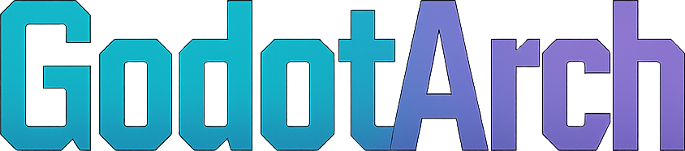

An extremely fast project structure linter four your Godot projects. GodotArch enforces consistent file organization and naming conventions across your Godot projects, making them more maintainable and easier to navigate. 

It can check scenes, scripts, nodes, assets, and more. It is also extremely configurable via its `godot-arch.config.yaml`

## How To Use

In order to use GodotArch you need to have its executable and configuration inside your project root.
- Download the latest release 
- Unpack the contents into your project-root (`godot-arch.config.yaml` and `godot-arch`)
- (*optional*) customize the configuration in `godot-arch.config.yaml`
- Execute  `godot-arch` either locally in your terminal or preferrably in your CI via e.g. GitHub-Actions

## Rules

### Files
- **MUST** have filename in `snake_case`

### Scenes (.tscn)
- **MUST** be in `(ROOT)/scenes/**` or `(ROOT)/globals/**`
- **MUST** have root node with same name as file in *PascalCase*
- **MUST** be in folder with same name as file

### Scripts (.gd)
- **MUST** be in `(ROOT)/scenes/**`, `(ROOT)/globals/**`, `(ROOT)/resources/**`, or `(ROOT)/test/**`
- **MUST** be in folder with same name as file

### Resources (.tres)
- **MUST** be in `(ROOT)/resources/**`
- **MUST** be in folder with same name as file

### Shaders (.gdshader)
- **MUST** be in `(ROOT)/shaders/**`

### Translations (.translation)
- **MUST** be in `(ROOT)/localization/**`

### Assets
- Images (.png, .jpg, etc.) **MUST** be in `(ROOT)/assets/images/**`
- Audio (.wav, .ogg, etc.) **MUST** be in `(ROOT)/assets/audio/**`

### Nodes
- Nodes ...
    - **MUST** have their name in *PascalCase*
    - This helps maintain consistency with Godot's built-in node naming conventions

## Configuration

The `godot-arch.config.yaml` file allows you to customize the linter's behavior. Here are the main configuration sections:

### ignorePatterns

Specify file patterns to be ignored by the linter:

```yaml
ignorePatterns:
    overall:  # Ignored by all rules
        - ./godot-arch.exe
        - ./addons/**
        - ...
    # You can also ignore files for specific rules
    "rule-allowed-file-location":
        - ./my_example_file.tscn
    "rule-filename-snake-case":
    "rule-parent-has-same-name":
    "rule-scene-nodes-pascal-case":
```

### allowedFileLocations

Define where specific file types are allowed to be located:

```yaml
allowedFileLocations:
    "./**/*.tscn":  # Scene files
        - ./globals/**
        - ./scenes/**
    "./**/*.gd":    # Script files
        - ./globals/**
        - ./scenes/**
    "./**/*.{png,jpg,jpeg,gif,webp,ico}":  # Image files
        - ./assets/images/**
```

### nodeNamePascalCaseExceptions

Configure exceptions for node naming conventions, especially useful for standard Godot nodes that don't follow PascalCase.

```yaml
nodeNamePascalCaseExceptions:
    - GPU: Gpu
    - VBoxContainer: VerticalBoxContainer
    - HBoxContainer: HorizontalBoxContainer
    # etc...
```

### Translation Key Names

If your project uses translation keys in node names (e.g., in TabContainer children):

```yaml
# Set to true if you use SCREAMING_SNAKE_CASE for translation keys in node names
allowScreamingSnakeCaseInNodeNames: false
```

Alternatively, you can add specific scenes to the ignore patterns if they contain translation keys.

## Planned Features

### Maintenance
- [ ] Split code into modules for better maintainability
- [ ] Write unit tests for core functionality

### Additional Tests
- [ ] Scripts and Scenes configured as autoload in project settings are actually inside of autoload and vice versa
- [ ] Root nodes of a scene that contain a script should have that script next to that scene

## Contributing

Contributions are welcome! Please feel free to submit a Pull Request.